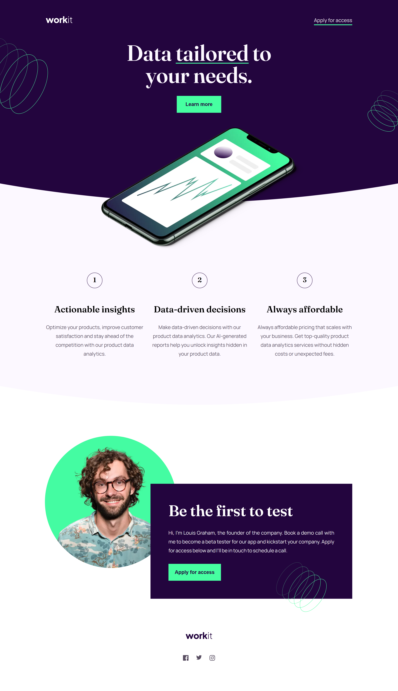
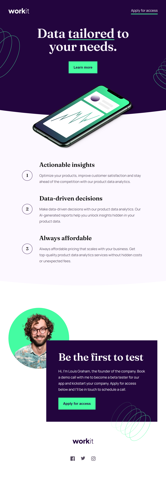
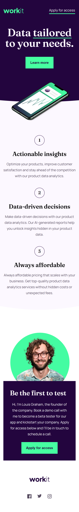

# Frontend Mentor - Workit landing page solution

This is a solution to the [Workit landing page challenge on Frontend Mentor](https://www.frontendmentor.io/challenges/workit-landing-page-2fYnyle5lu). Frontend Mentor challenges help you improve your coding skills by building realistic projects. 

## Table of contents

- [Overview](#overview)
  - [The challenge](#the-challenge)
  - [Screenshot](#screenshot)
  - [Links](#links)
- [My process](#my-process)
  - [Built with](#built-with)
  - [What I learned](#what-i-learned)
  - [Continued development](#continued-development)
  - [Useful resources](#useful-resources)
- [Author](#author)

## Overview

### The challenge

The challenge, according to Frontend Meentor, is to build out the "Workit" landing page and get it looking as close to the design as possible. To accomplish this, one may use any tool available. 

Users should be able to:

- View the optimal layout for the interface depending on their device's screen size
- See hover and focus states for all interactive elements on the page

My personal challenge also included:
- Use JavaScript to add additional effects
- Review the use of HTML, CSS, and JavaScript to refresh my skills

### Screenshot

### Links

- Solution URL: [GitHub Repository](https://github.com/jguleserian/FMC-Workit-Landing-Page)
- Live Site URL: [GitHub Pages](https://jguleserian.github.io/FMC-Workit-Landing-Page/)

## My process

### Built with

- Semantic HTML5 markup
- CSS custom properties
- Flexbox
- Mobile-first workflow
- JavaScript
- [GPS System of organizing CSS](https://github.com/jescalan/gps)

### What I learned

The main purpose of this exercise was to refresh my skills on frontend coding. I have some life changes that forced me to take a haiatus for several months. It's amazing how much one can forget in such a short period of time. Anyway, I wanted to make sure and use all the basics: HTML, CSS, and JavaScript. 

### Continued development

I want to continue my skills in JavaScript as well as frontend design libraries. I also want to get better at navegating GitHub.

### Useful resources

## Author

- Frontend Mentor - [@jguleserian](https://www.frontendmentor.io/profile/jguleserian)
- GitHub - [@jguleserian](https://github.com/jguleserian)
- LinkedIn - [@jeffguleserian](https://www.linkedin.com/in/jeffguleserian/)

# FMC-Workit-Landing-Page
